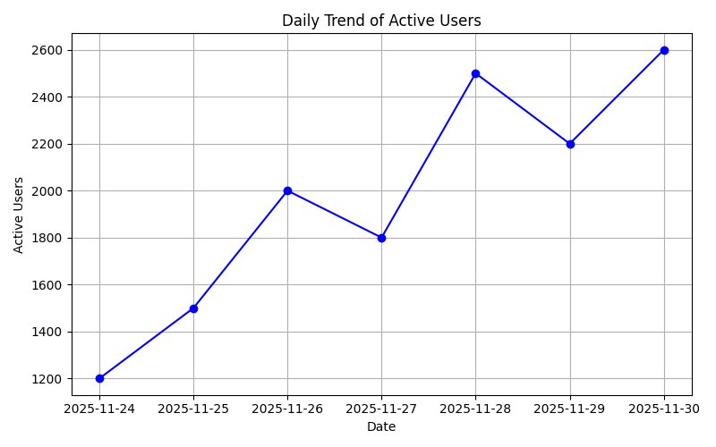
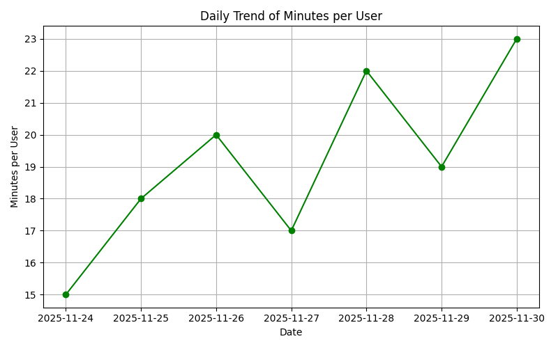
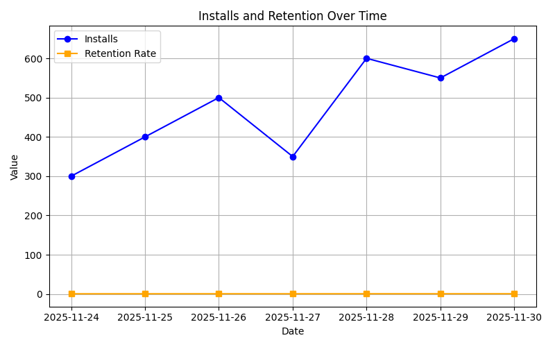
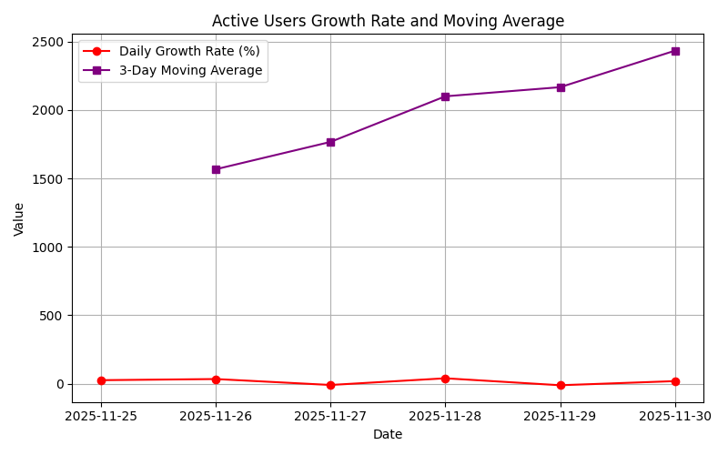

# Week 01 Report – App Metrics Analysis

## 1. Comparison of Pandas, NumPy, and SQLite

### Results

| Metric                      | Pandas (default) | NumPy (ddof=0) | NumPy (ddof=1) | SQLite (manual formula)            |
| --------------------------- | ---------------- | -------------- | -------------- | ---------------------------------- |
| Mean (minutes_per_user)     | 19.14            | 19.14          | 19.14          | 19.14                              |
| Variance (minutes_per_user) | 7.81             | ~6.69          | 7.81           | 7.81 (÷N-1) / ~6.69 (÷N)           |
| Std Dev (minutes_per_user)  | 2.79             | ~2.58          | 2.79           | 2.79 (÷N-1) / ~2.58 (÷N)           |
| Variance (active_users)     | 262380.95        | ~224326.53     | 262380.95      | 262380.95 (÷N-1) / ~224326.53 (÷N) |
| Std Dev (active_users)      | 512.23           | ~473.72        | 512.23         | 512.23 (÷N-1) / ~473.72 (÷N)       |

### Analysis

- **Pandas** defaults to sample statistics (division by N-1).
- **NumPy** defaults to population statistics (division by N), unless `ddof=1` is specified.
- **SQLite** requires manual formulas. Depending on denominator choice, results match either Pandas or NumPy.
- All three tools are consistent once the definition (sample vs population) is aligned.

---

## 2. Daily Trend of Active Users

- The overall trend of active users in Week 01 is upward.
- Starting from ~1200 users on November 24 and reaching ~2600 users on November 30.
- Temporary dips on November 27 and 29 suggest natural fluctuations or day-specific behavior.

---

## 3. Minutes per User

- Average usage time increased from **15 minutes** at the start of the week to **23 minutes** at the end.
- This indicates not only more users, but also deeper engagement per user.

---

## 4. Installs and Retention

- Installs grew from **300 to 650**.
- Retention improved from **65% to 78%**.
- Together, these metrics show both quantitative growth and qualitative improvement in user loyalty.

---

## 5. Growth Rate and Moving Average

- Daily growth rate fluctuated, with declines on November 27 and 29.
- The 3-day moving average shows a smoother, consistent upward trend.
- This combination highlights both short-term volatility and long-term stability.

---

## 6. User Clustering Based on Usage Behavior

- **Light users:** low minutes, high volume.
- **Medium users:** moderate minutes.
- **Heavy users:** high minutes, smaller group but highly engaged.
- Segmentation supports tailored strategies:
  - Light users → incentives to increase engagement.
  - Heavy users → focus on retention and premium features.

---

## 7. Educational Note: ddof=0 vs ddof=1

- **ddof=0 (NumPy default):** Population variance, divide by N → smaller variance/stddev.
- **ddof=1 (Pandas default):** Sample variance, divide by N-1 → unbiased estimates.
- **SQLite:** Manual formulas replicate either definition depending on denominator choice.

**Conclusion:** Pandas and NumPy with `ddof=1` match exactly. NumPy with `ddof=0` and SQLite with division by N give slightly smaller values. This difference is definitional, not computational.

---

## 📌 Overall Conclusion

- Pandas, NumPy, and SQLite produce consistent results once definitions are aligned.
- Daily trend analysis reveals short-term fluctuations in active users.
- Minutes per user, installs, and retention confirm growth in both quantity and quality.
- User clustering provides actionable insights for engagement strategies.
- Understanding the difference between population and sample statistics (ddof=0 vs ddof=1) is essential for accurate reporting.

---
